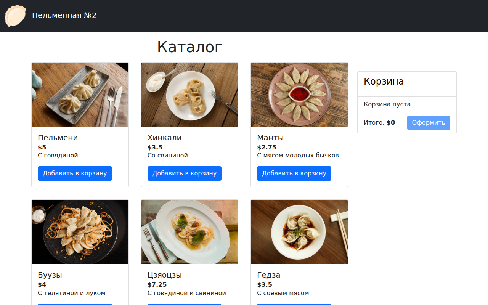
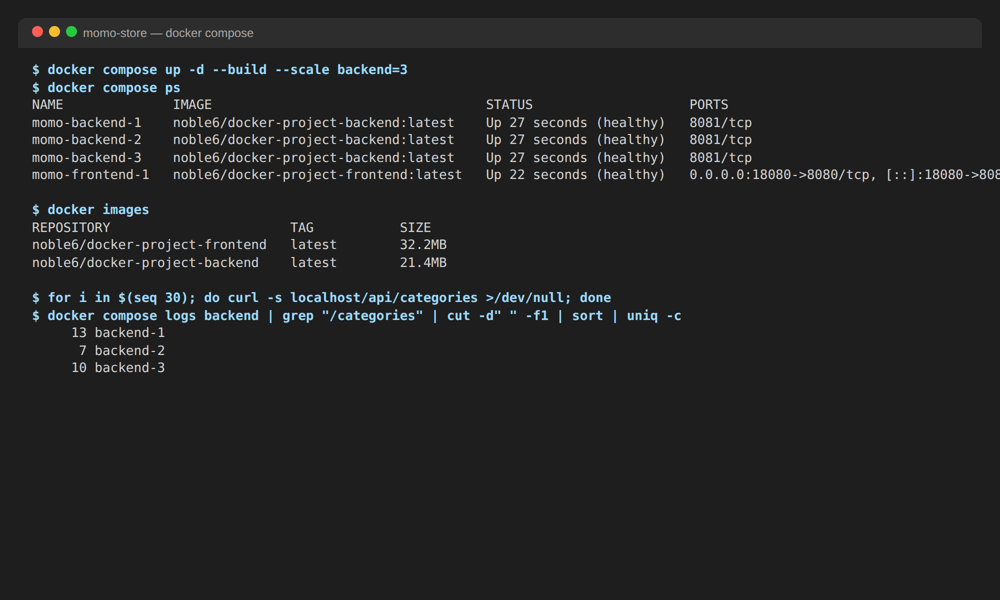
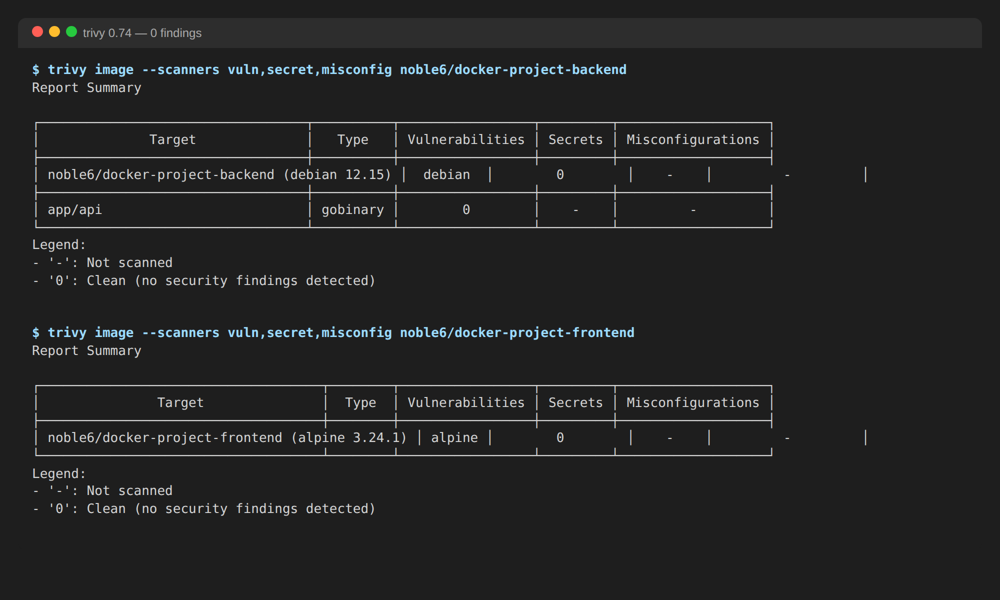

# Momo Store — Docker-контейнеризация и хранение данных

Проектная работа дисциплины «Docker-контейнеризация и хранение данных».
Приложение «Пельменная №2»: фронтенд на Vue.js и бэкенд на Go, упакованные в два образа и собранные в стек Docker Compose.

- Образы: `noble6/docker-project-backend`, `noble6/docker-project-frontend` (Docker Hub, теги `latest` и SHA коммита)
- Фронтенд отвечает на порту **80**, бэкенд слушает **8081** и доступен только через nginx



## Быстрый старт

```bash
git clone https://github.com/bitcoineazy/kittygram-docker.git && cd kittygram-docker

# собрать и запустить весь стек (nginx :80 -> backend :8081)
docker compose up -d --build

# то же с тремя экземплярами бэкенда за балансировщиком
docker compose up -d --build --scale backend=3

# проверить
curl http://localhost/healthz          # nginx
curl http://localhost/api/health       # бэкенд через nginx
curl http://localhost/api/products     # каталог
open http://localhost                  # сайт

# остановить
docker compose down
```

Образы по отдельности:

```bash
docker build -t momo-backend  ./backend
docker build -t momo-frontend ./frontend
docker run -d -p 8081:8081 momo-backend
docker run -d -p 80:8080 -e BACKEND_URL=http://host.docker.internal:8081 momo-frontend
```

Профиль разработки (фронтенд с hot-reload на `:8080` поверх того же бэкенда):

```bash
docker compose --profile dev up
```



## Структура

```
backend/
  Dockerfile              # multi-stage: golang:1.27-alpine -> distroless/static (nonroot)
  .dockerignore
  cmd/api/main.go         # PORT из окружения, подкоманда `healthcheck`
frontend/
  Dockerfile              # multi-stage: node:16-alpine -> nginx-unprivileged:1.30-alpine-slim
  .dockerignore
  nginx/default.conf.template   # SPA + прокси /api/ -> backend, рендерится envsubst при старте
docker-compose.yml        # backend, frontend, профиль dev; сети, volumes, лимиты, healthchecks
.env.example              # переменные для compose
.github/workflows/deploy.yaml   # сборка и пуш образов, compose smoke-test, Trivy
docs/img/                 # скриншоты
```

## Образы

| Образ | База сборки | База рантайма | Размер |
|-|-|-|-|
| `docker-project-backend` | `golang:1.27-alpine` (381 МБ) | `gcr.io/distroless/static-debian12:nonroot` | **21,4 МБ** |
| `docker-project-frontend` | `node:16-alpine` | `nginxinc/nginx-unprivileged:1.30-alpine-slim` | **32,2 МБ** |

Почему так:

- **Multi-stage.** В финальный образ попадает только результат: статический бинарник Go (`CGO_ENABLED=0`, `-ldflags "-s -w"`, `-trimpath`) и каталог `dist` фронтенда. Компиляторы, `node_modules` и исходники остаются в стадии сборки.
- **distroless/static** для бэкенда: нет shell, пакетного менеджера и libc — нечему быть уязвимым и нечем воспользоваться при взломе. Так как в образе нет `curl`/`wget`, бинарник сам умеет проверять себя: `api healthcheck` делает GET на `/health` и возвращает код выхода — это и используется в `HEALTHCHECK`.
- **nginx-unprivileged alpine-slim** для фронтенда: работает от uid 101 и слушает 8080 (наружу публикуется как 80), а вариант `slim` не содержит динамических модулей nginx (xslt, image-filter, geoip, njs) и их библиотек (libxml2, libxslt, libgd). Именно libxml2 давал 11 CVE в обычном `alpine`-образе, поэтому был выбран `slim`; в рантайм-слое дополнительно выполняется `apk upgrade`.
- **Порядок слоёв и кэш.** Сначала копируются только `go.mod`/`go.sum` и `package*.json`, затем ставятся зависимости, и только потом — исходники. Зависимости пересобираются лишь при их изменении; `--mount=type=cache` сохраняет кэш `go mod` и `npm` между сборками.
- **`.dockerignore`** исключает `node_modules`, `dist`, `.git`, `.env*`, IDE-файлы — контекст сборки маленький, секреты и мусор в образ не попадают.
- **Теги.** Пайплайн публикует `latest` и неизменяемый тег с SHA коммита; в бэкенд SHA передаётся build-аргументом `VERSION`.
- `node:16`, а не новее: `vue-cli 4` / `webpack 4` не запускаются на OpenSSL 3 из Node ≥ 17.

## Конфигурирование

Build-аргументы:

| Аргумент | Образ | По умолчанию | Назначение |
|-|-|-|-|
| `GO_VERSION` | backend | `1.27` | версия Go в стадии сборки |
| `VERSION` | backend | `dev` | версия сборки (в CI = SHA коммита) |
| `NODE_VERSION` | frontend | `16` | версия Node в стадии сборки |
| `NGINX_VERSION` | frontend | `1.30` | версия nginx в рантайме |
| `VUE_APP_API_URL` | frontend | `/api` | куда браузер шлёт запросы API (вшивается в бандл) |
| `VUE_APP_PUBLIC_PATH` | frontend | `/` | префикс, с которого раздаётся SPA |

Переменные окружения:

| Переменная | Контейнер | По умолчанию | Назначение |
|-|-|-|-|
| `PORT` | backend | `8081` | порт HTTP-сервера |
| `BACKEND_URL` | frontend | `http://backend:8081` | адрес бэкенда для прокси `/api/` |
| `NGINX_PORT` | frontend | `8080` | порт nginx внутри контейнера |

Переменные compose (`.env`, образец в `.env.example`): `FRONTEND_PORT` (порт на хосте, по умолчанию 80), `DOCKER_USER`, `TAG`, `VERSION`, `VUE_APP_API_URL`, `VUE_APP_PUBLIC_PATH`.

Пример: собрать фронтенд, который ходит на внешний API, и запустить сайт на 8000-м порту:

```bash
docker build -t momo-frontend --build-arg VUE_APP_API_URL=https://api.example.com ./frontend
FRONTEND_PORT=8000 docker compose up -d
```

## Docker Compose

- **Сервисы:** `backend` (Go), `frontend` (nginx со статикой и прокси `/api/`), `frontend-dev` (только в профиле `dev`: `node:16-alpine`, `npm run serve`, исходники смонтированы, `node_modules` в отдельном volume).
- **Зависимости:** `frontend` стартует после того, как `backend` станет `healthy` (`depends_on: condition: service_healthy`).
- **Сети:** две изолированные bridge-сети. `frontend-net` — внешняя сторона nginx; `backend-net` помечена `internal: true`, у бэкенда нет ни опубликованных портов, ни выхода в интернет — до него можно достучаться только из nginx.
- **Healthchecks:** у бэкенда `api healthcheck` (GET `/health`), у nginx `wget /healthz`; интервал 15 с, 3 попытки, `start_period` 5 с.
- **Перезапуск:** `restart: unless-stopped` у обоих сервисов.
- **Лимиты:** backend 0,5 CPU / 128 МБ, frontend 0,5 CPU / 64 МБ (`deploy.resources.limits`, плюс `reservations`); логи ротируются (`json-file`, 3 × 10 МБ).
- **Volumes:** приложение хранит каталог в памяти и ничего не пишет на диск, поэтому именованные volumes нужны только nginx, который работает с read-only корнем: `nginx-cache` (`/var/cache/nginx`), `nginx-run` (`/var/run`), `nginx-conf` (`/etc/nginx/conf.d`, туда `envsubst` кладёт отрендеренный конфиг) и `tmpfs` на `/tmp` с правами `1777`. Volumes принадлежат uid 101 — тому же пользователю, от которого работает nginx.

### Масштабирование и балансировка

`docker compose up -d --scale backend=N` поднимает N экземпляров бэкенда. Бэкенд без состояния и без опубликованных портов, поэтому конфликтов нет. nginx проксирует `/api/` на имя `backend`, а в конфиге указан встроенный DNS Docker (`resolver 127.0.0.11 valid=10s`) и `proxy_pass` через переменную — так nginx перечитывает список адресов каждые 10 секунд и раскладывает запросы по всем живым экземплярам без перезапуска. На скриншоте выше 30 запросов к `/api/categories` разошлись по трём контейнерам.

## Безопасность

Контейнеры:

- **Не root.** Бэкенд — `nonroot` (uid 65532) из distroless, фронтенд — `nginx` (uid 101), непривилегированный порт 8080.
- **Минимальные образы.** В distroless нет shell и пакетного менеджера; в `alpine-slim` нет модулей nginx; в финальные образы не попадают компиляторы, `node_modules` и исходники.
- **Изоляция и ограничения:** `read_only: true` для корневой ФС, `cap_drop: [ALL]`, `security_opt: no-new-privileges`, лимиты CPU и памяти, внутренняя сеть без выхода наружу, опубликован только порт 80.
- **Заголовки nginx:** `server_tokens off`, `X-Content-Type-Options`, `X-Frame-Options`.

Секреты:

- В образах нет ни одного секрета: приложение их не использует, `.env*` исключён через `.dockerignore`, `.env` — через `.gitignore` (в репозитории только `.env.example`). Trivy сканирует образы сканером `secret` — находок нет.
- Учётные данные Docker Hub живут только в GitHub Secrets (`DOCKER_USER`, `DOCKER_PASSWORD`) и используются одним шагом `docker/login-action`.
- Если приложению понадобится секрет (например, DSN базы), он подключается как файловый секрет compose (`secrets:` → `/run/secrets/<name>`), а не через переменную окружения или слой образа.

Образы:

- **Сканирование.** Job `security_scan` в пайплайне запускает Trivy для обоих опубликованных образов: сначала полный отчёт по всем уровням (vuln + secret + misconfig, включая неисправленные), затем шаг-гейт, который валит пайплайн при `CRITICAL`/`HIGH`. Локально: `trivy image noble6/docker-project-backend:latest`.
- **Результат.** Оба образа — 0 находок во всех уровнях severity и по Trivy 0.74, и по Docker Scout (тот же движок, что показывает CVE на Docker Hub). Для этого зависимости Go обновлены до актуальных (`go get -u ./...`, Go 1.27 — в Go 1.22 была уязвимость stdlib), а nginx переведён на `alpine-slim`.
- **Обновление баз.** Версии базовых образов вынесены в build-аргументы; `apk upgrade` в рантайм-слое фронтенда подтягивает свежие исправления Alpine при каждой сборке.



## CI/CD (`.github/workflows/deploy.yaml`)

Исходные задания пайплайна сохранены без изменений, добавлено:

1. `build_and_push_to_docker_hub` — дополнительно публикует теги с SHA коммита.
2. `run-with-docker-compose` — после сборки через compose поднимает стек с `--scale backend=2 --wait` и проверяет `/healthz`, `/api/health`, `/api/products` и главную страницу.
3. `security_scan` (новый job, после публикации) — Trivy по матрице из двух образов.

Секреты репозитория: `DOCKER_USER`, `DOCKER_PASSWORD`.
